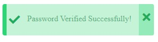
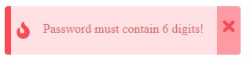
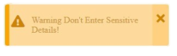
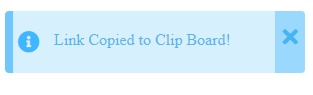

# A Custom Toast Notification for Html!

These above ☝️ contains the toast files written in simple html and js.
Just delete the Html File and include the location toast.js and toast.css file
and also include fontaswesome cdn link
i.e. [https://cdnjs.cloudflare.com/ajax/libs/font-awesome/5.15.2/css/all.min.css](https://cdnjs.cloudflare.com/ajax/libs/font-awesome/5.15.2/css/all.min.css)

# Toast

Available Toast are success, error, info and warning
To use toast just use.
>Just  call  toast(ContainerPosition, Content, Type, Autodismis, time)
- Here time is Time for auto dismiss and Autodismiss is a bollean vaue
- Available  options for Container Positions are  top-left,top-center,top-right,bottom-left,bottom-center,bottom-right
- Available options for Type are success, Error, Info, Warning
- **Call the above function from a html tag on luck or include in a function**
- **Just enter the I'd "alert-btn" on the submit button or a tag or any element**
>Example:- ```<button id="alert-btn" onclick="toast('top-right','Warning Don\'t Enter Sensitive Details!','Warning',false,4000)">Show Alert</button>```


# Images
## Success

## Error

## Warning

## Info


> **Note:**  
>>💀 Never use Other values For **ContainerPosition** and **Type** other than specified.
>>⚠️ And Use Only One Toast Area At a particular page

# CopyRight &copy; are restricted License under [MIT License](LICENSE)
